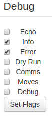

# Repetier Debug Flags

Options on the controls page for changing the debug flags in Repetier firmware. Easily put your printer in "dry run" mode to test out top speed!

###### Some options may not work depending on version of Repetier firmware

## Setup

Install ~~via the bundled [Plugin Manager](https://github.com/foosel/OctoPrint/wiki/Plugin:-Plugin-Manager)
or~~ manually using this URL:

    https://github.com/ntoff/OctoPrint-Debugflags/archive/master.zip

